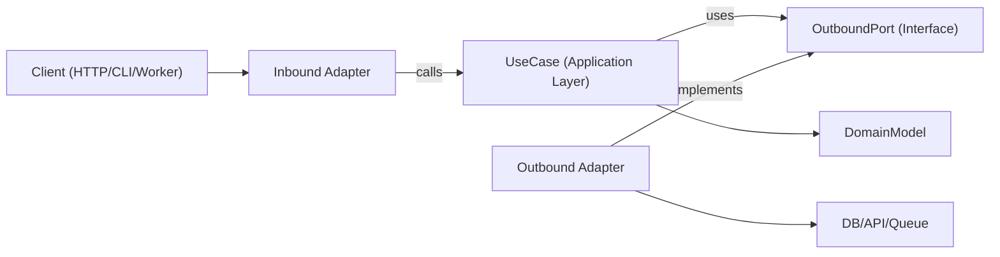

| 5N1K | Açıklama |
|:----:|:---------|
| **Kim** | AI/ML mühendisi |
| **Ne** | Architecture Diagram |
| **Nerede** | AI_ML/ |
| **Ne Zaman** | AI/ML görevi gerektiğinde |
| **Neden** | standardize etmek için |
| **Nasıl** | Skill adımlarını takip ederek |

## Architecture Diagram

