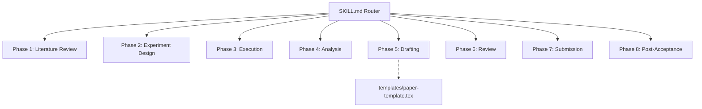

# Academic Research & Paper Writing Suite (Modular Router)

Bu skill, akademik araştırma sürecini 8 bağımsız faza bölen modüler bir yönlendiricidir. LLM'in bellek (token) limitlerini aşmamak ve odaklanmış talimatlar üretmek için süreç boyunca sadece aktif olduğunuz fazın referans dosyasını yükleyin.

## 🎯 Aktif Araştırma Fazını Seçin

Kullanıcı ile etkileşime girerken, sürecin hangi aşamasında olunduğunu belirleyin ve ilgili referans dosyasını (`references/phase-[X]-*.md`) dinamik olarak yükleyip oradaki spesifik talimatları uygulayın.

## Faz Haritası ve Referans Dosyaları

| Faz | Odak Alanı | İlgili Referans Dosyası |
|-----|------------|------------------------|
| Phase 1 | Literature Review (Literatür Taraması, Gap Analysis) | `references/phase-1-literature-review.md` |
| Phase 2 | Experiment Design (Metodoloji Tasarımı, Hipotezler) | `references/phase-2-experiment-design.md` |
| Phase 3 | Execution (Veri Toplama, Simülasyon, Kodlama) | `references/phase-3-execution.md` |
| Phase 4 | Analysis (İstatistiksel Analiz, Bulguların Görselleştirilmesi) | `references/phase-4-analysis.md` |
| Phase 5 | Drafting (Makalenin Yazımı, LaTeX Entegrasyonu) | `references/phase-5-drafting.md` |
| Phase 6 | Review & Refinement (Akademik Dil, Hakem Simülasyonu) | `references/phase-6-review.md` |
| Phase 7 | Submission (Dergi Seçimi, Cover Letter Hazırlığı) | `references/phase-7-submission.md` |
| Phase 8 | Post-Acceptance (Revizyon Yanıtları, Kamera Hazır Kopya) | `references/phase-8-post-acceptance.md` |

## Kullanım

Bir araştırma görevi aldığınızda:

1. Mevcut fazı belirleyin (kullanıcıya sorun veya bağlamdan çıkarım yapın)
2. `skill_view(name="research-paper-writing", file_path="references/phase-[X]-*.md")` ile ilgili reference dosyasını yükleyin
3. O fazdaki talimatları adım adım uygulayın
4. Bir faz bittiğinde, bir sonraki faza geçin ve ilgili reference dosyasını yükleyin

> **Not:** Her reference dosyası kendi içinde bağımsızdır. Aynı anda sadece BİR faz aktif olmalıdır.
